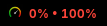
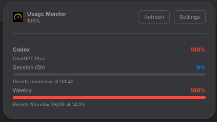

# GNOME Shell extension

The GNOME Shell extension is embedded in the CLI binary; its source lives in
[`usage-monitor-cli/assets/gnome/`](../../usage-monitor-cli/assets/gnome) and
is installed by the `widget install` subcommand. It supports GNOME Shell 45–49
and uses the ESM extension format.

The top-bar indicator shows the project icon and selected usage percentages:



Clicking it opens the popup, with one card per provider/account:



## Features

- The top bar shows the Usage Monitor icon and selected Session (5h), Weekly,
  and Monthly percentages. With no pinned account, it shows the highest value
  for each window across providers; a pin limits the values to a provider or
  account. The indicator color follows the highest displayed value: accent
  below 70%, warning from 70% to 89%, and critical at 90% or higher. It dims
  when the data is stale. **Show bar text** hides the percentages while keeping
  the icon.
- The popup shows one card per provider/account, with its headline percentage,
  account email/label/plan, usage bars, reset times, and 30-day cost when
  available. Providers can report different windows, so each card shows the
  windows returned for that account. If a live fetch fails, the popup explains
  the error and can show the last successful value as stale.
- Popup toolbar: **Refresh** and **Settings**.
- **Preferences** (the popup's Settings button or GNOME Extension Manager) has
  six pages:
  - **General** — refresh interval, panel text, account email, decimal places,
    pinned provider/account, usage windows shown in the bar, and cache clearing.
  - **Providers** — provider toggles and account setup forms shaped to each
    provider's authentication type.
  - **Order** — reorder provider cards; an empty order uses the CLI order.
  - **Theme** — follow the GNOME Shell theme, choose a light/dark or built-in
    palette, or edit a custom palette; set popup opacity, bar height, and card
    corner radius.
  - **Updates** — compare the installed extension with the CLI version and
    reinstall it from the current CLI binary.
  - **About** — project details with a clickable link to the project website.
- Provider and account settings are shared with `usage-monitor-cli`. Usage
  results are cached separately for this extension and displayed as stale when
  the CLI is unavailable or a refresh fails.

## Install

Build/install the CLI first so `usage-monitor-cli` is available:

```bash
cargo install --path usage-monitor-cli
```

Then install the extension locally:

```bash
usage-monitor-cli widget install gnome
gnome-extensions enable usage-monitor@usage-monitor.dev
```

The installer copies the extension to
`~/.local/share/gnome-shell/extensions/usage-monitor@usage-monitor.dev/`,
compiles its GSettings schema, and records its version for the login
`widget sync` upgrade path (see
[Automatic upgrades](README.md#automatic-upgrades)). You can also enable it in
GNOME Extension Manager. Remove it with
`usage-monitor-cli widget uninstall gnome`, and inspect resolved paths with
`usage-monitor-cli widget doctor`.

**On Wayland, log out and back in after installing or updating extension code**
so GNOME Shell loads the new files. Unlike X11 (`Alt`+`F2`, then `r`), a Wayland
session cannot restart the Shell in place. Refreshing usage data does not
require a new session.

### Install from extensions.gnome.org

The store listing contains the extension JavaScript only; GNOME's store rules
do not allow the CLI binary to be bundled. Install `usage-monitor-cli`
separately using the instructions above. Do not enable the store copy and the
CLI-installed copy at the same time: they share a UUID, and the local copy
shadows the store copy.

## Runtime files

The extension runs `usage-monitor-cli widget gnome` to get the same JSON
payload used by the other widgets. If an older CLI does not recognize
`widget gnome`, the extension falls back to `widget kde`, which uses the same
payload contract.

The extension checks `~/.cargo/bin/` and `~/.local/bin/` before the GNOME Shell
`PATH`, so a user-installed CLI takes priority over an older system copy. To
use a CLI from another location, set `USAGE_MONITOR_BIN` to its absolute path
in the GNOME Shell session environment before logging in. Setting it only in a
terminal does not affect the running Shell. For example:

```bash
export USAGE_MONITOR_BIN="$HOME/custom/bin/usage-monitor-cli"
```

The extension stores its preferences in GSettings under
`org.gnome.shell.extensions.usage-monitor`. The refresh interval defaults to
30 seconds and can be set from 10 seconds to one hour. It stores the last
successful usage payload in
`$XDG_CACHE_HOME/usage-monitor-gnome/last.json` (usually
`~/.cache/usage-monitor-gnome/last.json`), separate from the KDE and Waybar
caches. The panel and popup use that cached payload as stale data when a live
fetch fails.

## Theming

The **Theme** preferences page controls the popup palette and usage bars:

| Mode | What it does |
|------|--------------|
| **System** (default) | Uses colors from the active GNOME Shell theme. |
| **Light / Dark** | Uses the bundled macOS Light or macOS Dark palette. |
| **Built-in** | Selects one of five bundled palettes: macOS Dark, macOS Light, Nord, Dracula, or Tokyo Night. |
| **Custom** | Overrides any of the eight palette colors: background, text, subtext, accent, warning, critical, track, and border. |

The page also controls popup background opacity, progress-bar height, and card
corner radius. Opacity ranges from 30% to 100%; only the popup background
fades, while text and bars stay fully opaque. Bar height ranges from 2 to 16
pixels, and corner radius from 0 to 16 pixels. Theme changes apply to the
popup and panel without reinstalling the extension. Custom colors accept
`#rgb` and `#rrggbb` values; invalid entries fall back to the selected base
palette.

## Managing accounts

Open **Providers** in the preferences and expand a provider to see its status,
account form, and any sign-in instructions. Turn on its switch to enable
fetching. Enter an account name, optionally add a display label, fill in the
required authentication fields, and choose **Add account**. Secret fields are
masked and passed to the CLI over stdin when saved. Use **Remove** to delete an
explicitly added account; changing the provider switch does not delete it.

The form follows each provider's authentication type:

| Auth type | Providers | Add form |
|-----------|-----------|----------|
| **API key** | openai, anthropic, openrouter, groq, deepseek, kimik2, minimax, moonshot, venice, zai, elevenlabs | account name + API key |
| **API key with extra field** | deepgram, llmproxy | account name + API key + project ID (deepgram) or base URL (llmproxy) |
| **Token** | grok, kimi, copilot, windsurf, devin, opencode-go | account name + token/API key; Devin also asks for an organization |
| **Cookie** | abacus, mistral, ollama, cursor, perplexity | account name + session cookie |
| **OAuth / CLI** | codex, claude, gemini, antigravity | account name + credentials path or access token, depending on provider |

OAuth providers may require a sign-in in their own CLI before you enter the
credentials path. The form shows provider-specific setup hints. See the
individual provider guides in [`docs/providers/`](../providers/README.md) for
the full authentication steps. Antigravity may also need an OAuth client ID
and client secret so its token can be refreshed.

## CLI commands

These commands show the data source and update status used by the extension:

```bash
usage-monitor-cli widget gnome
usage-monitor-cli widget check-update --pretty gnome
usage-monitor-cli widget sync gnome
```

The extension runs the widget command automatically on its refresh interval
and when you press **Refresh**. The Preferences → General page can clear the
GNOME-specific cached payload.

## Troubleshooting

- **The panel shows `--`:** no live or cached payload is available. Open the
  popup for its notice, or run `usage-monitor-cli widget gnome` in a terminal
  to inspect the output. When a previous payload exists, it remains visible
  and is marked stale while a refresh is failing.
- **The popup says “Live usage unavailable”:** run the widget command above to
  see the CLI error. If the CLI reports that `widget gnome` is unknown, update
  it with `cargo install --path usage-monitor-cli --force`. If cached demo or
  stale data is no longer useful, clear it in Preferences → General → Cached
  usage data.
- **The extension is not loading:** check that its UUID is enabled with
  `gnome-extensions list --enabled`. On Wayland, log out and back in after
  installation or an extension-code update.
- **The UI did not change after an update:** run
  `usage-monitor-cli widget install gnome` again, then relog on Wayland.
  `widget sync` handles this automatically at login once local installation
  has been set up.

## Tests

```bash
python -m unittest discover -s widgets/gnome -p 'test_*.py'
```
