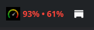
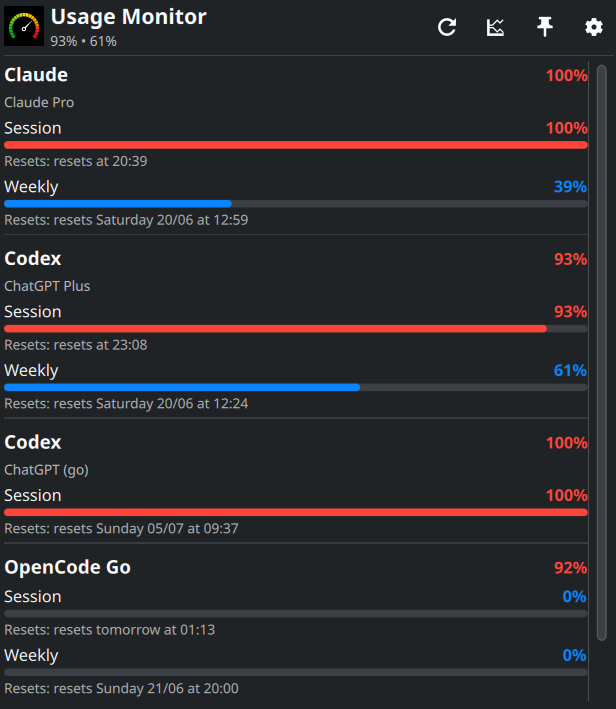

# KDE Plasma 6 widget

The plasmoid is embedded in the CLI binary; its source lives in the asset tree
at
[`usage-monitor-cli/assets/kde/package`](../../usage-monitor-cli/assets/kde/package)
and is written to disk by the `widget install` subcommand.

The panel bar shows the logo and the overall usage:



Clicking it opens the full popup, with one card per provider/account:



## Features

- Panel bar shows the bundled Usage Monitor logo plus the overall usage text (or
  a single pinned provider); the icon scales to the panel thickness so it stays
  visible on thin panels.
- Full popup (usage only) with one card per provider/account, an overall
  percentage, and a progress bar for every usage window (Session/Weekly/Monthly)
  returned by the provider, plus reset times and error/stale indicators.
- Popup toolbar: Refresh, Cost, **Pin** (keep popup open), and **Settings** (opens
  the native KDE configuration window).
- **Settings live in the native KDE config dialog** (right-click → Configure, or
  the popup Settings button), not in the popup, split into three pages:
  - **General** — refresh interval, show bar text, show account email, pin a
    provider to the panel bar, clear cache, and the CLI/plasmoid version footer.
  - **Providers** — search + enable/disable toggles
    (`usage-monitor-cli enable|disable <provider>`) and **Manage accounts** per
    provider: add/remove named accounts with a form shaped per provider auth type
    (see below), plus add/remove **workspaces** for opencode-go.
  - **Order** — drag to reorder providers.
- The plasmoid **About** page (a fourth, native page in the same window) is
  populated from `metadata.json` (name, description, author, website, version);
  its bug-report link points to the project issues.
- Account identity under each usage card: the account **email** when the provider
  exposes it (e.g. Codex, decoded from the OAuth `id_token`), otherwise a
  configured label/id, otherwise the plan — so a card is never blank. (Claude's
  token carries no email, so it shows the plan.)
- Last-good cache fallback when the CLI is unavailable or a fetch fails.

## Install

Build/install the CLI first so `usage-monitor-cli` is on `PATH`:

```bash
cargo install --path usage-monitor-cli
```

Then install the plasmoid:

```bash
usage-monitor-cli widget install kde
```

This stages the package under `~/.local/share/usage-monitor/kde/package` and
registers it with `kpackagetool6` (`--install` or `--upgrade` automatically). If
`kpackagetool6` is missing or fails, re-run with `--force` to copy the package
straight into `~/.local/share/plasma/plasmoids/dev.usage-monitor.kde`. Remove it
with `usage-monitor-cli widget uninstall kde`, and inspect resolved paths with
`usage-monitor-cli widget doctor`.

The installer also records the version and adds a login autostart entry that
runs `usage-monitor-cli widget sync`, so upgrading the CLI auto-upgrades the
plasmoid on the next login (see [Automatic upgrades](README.md#automatic-upgrades)).

Manual development install with `kpackagetool6` (equivalent to the above):

```bash
kpackagetool6 --type Plasma/Applet --install usage-monitor-cli/assets/kde/package
kpackagetool6 --type Plasma/Applet --upgrade usage-monitor-cli/assets/kde/package
kpackagetool6 --type Plasma/Applet --remove dev.usage-monitor.kde
```

If Plasma cannot find the CLI, set `USAGE_MONITOR_BIN` to an absolute path:

```bash
export USAGE_MONITOR_BIN="$HOME/.cargo/bin/usage-monitor-cli"
```

## Runtime files

The QML UI calls `contents/code/usage_monitor_kde.py`, which finds
`usage-monitor-cli` on `PATH` or uses `USAGE_MONITOR_BIN`. The helper caches the
last good payload in `$XDG_CACHE_HOME/usage-monitor-kde/last.json` and shows it
as stale if the CLI is temporarily unavailable.

The KDE widget also keeps widget-only state in
`$XDG_CONFIG_HOME/usage-monitor-kde/state.json` for bar text, refresh interval,
pinned provider, and provider order. Settings are edited in the **native KDE
config dialog** (`contents/config/config.qml` registers the General/Providers/Order
pages). All settings live in the helper's `state.json`, not KConfig, so the pages
drive the native **Apply/OK/Cancel** the same way the Plasma System Monitor does:
each page declares `signal configurationChanged` (emitted on edit → enables Apply)
and `function saveConfig()` (called on Apply/OK → writes the pending values via
the helper). General (refresh interval, bar text, account email, pin) and Order
(drag reorder) are **Apply-driven**; provider enable/disable, accounts, workspaces
and clear cache are immediate actions. `main.xml` only needs to exist for the
dialog to appear.

The UI is a port of the `codexbar-kde` plasmoid; codexbar-only controls (source
selector, all-accounts / status-pages / hide-credits switches) were dropped since
Usage Monitor auto-detects a single source per provider. The single-file helper
`usage_monitor_kde.py` owns all CLI, cache and formatting logic so it can be
tested without KDE running.

The Plasma UI lives under `contents/ui/`: `main.qml` (panel + usage popup),
`FullPopup.qml`, `UsagePage.qml`, `UsageBar.qml`; the config pages
`configGeneral.qml`, `configProviders.qml`, `configOrder.qml`; and their shared
helper plumbing `SettingsBackend.qml`.

## Managing accounts

Open **Manage accounts** under a provider. The add form adapts to how each
provider authenticates:

| Auth type | Providers | Add form |
|-----------|-----------|----------|
| **API key** | openai, anthropic, openrouter, groq, deepseek, kimik2, minimax, moonshot, venice, zai, elevenlabs, deepgram (+project id), llmproxy (+base url) | name + API key |
| **Token** | grok, kimi, copilot, devin (+org), windsurf | name + token |
| **Cookie** | abacus, mistral, ollama, cursor, perplexity | name + session cookie |
| **OAuth / CLI** | codex, claude, gemini, antigravity | name + credentials path (login done in a terminal — see below) |
| **opencode-go** | opencode-go | name + cookie, plus workspace add/remove |

OAuth providers need a CLI login **before** pointing the widget at the
credentials file. The form shows the exact commands; for example, a second Codex
account needs its own isolated login (you cannot copy `auth.json`):

```bash
CODEX_HOME=~/.codex-go codex login --device-auth   # in a terminal
# then in the widget: Manage accounts → name "go", credentials path ~/.codex-go/auth.json
```

See the per-provider pages under [`docs/providers/`](../providers/README.md) for
the full multi-account setup of codex, claude, gemini, and antigravity.

## Helper commands

These are mostly for debugging; Plasma calls them automatically:

```bash
CODE=usage-monitor-cli/assets/kde/package/contents/code/usage_monitor_kde.py
python "$CODE" summary
python "$CODE" settings
python "$CODE" cache
python "$CODE" cache-clear
python "$CODE" cost
python "$CODE" set-state --key refreshIntervalSeconds --value 60
python "$CODE" set-provider --provider claude --enabled true
python "$CODE" account-save --provider openai --name work --json '{"api_key":"sk-…"}'
python "$CODE" account-remove --provider openai --name work
python "$CODE" workspace-add --workspace wrk_… --name "My WS"
python "$CODE" workspace-remove --workspace wrk_…
```

## Troubleshooting

- Stale panel data: open settings, **Clear cache**, then **Refresh**.
- Toggle failures: run the equivalent CLI command in a terminal, e.g.
  `usage-monitor-cli claude account list`.
- Old UI after upgrade: run `usage-monitor-cli widget install kde` again (it
  upgrades in place) and restart Plasma if the old UI is still cached.

## Tests

```bash
python -m unittest discover -s widgets/kde -p 'test_*.py'
qmllint usage-monitor-cli/assets/kde/package/contents/ui/*.qml
```
