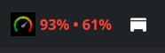
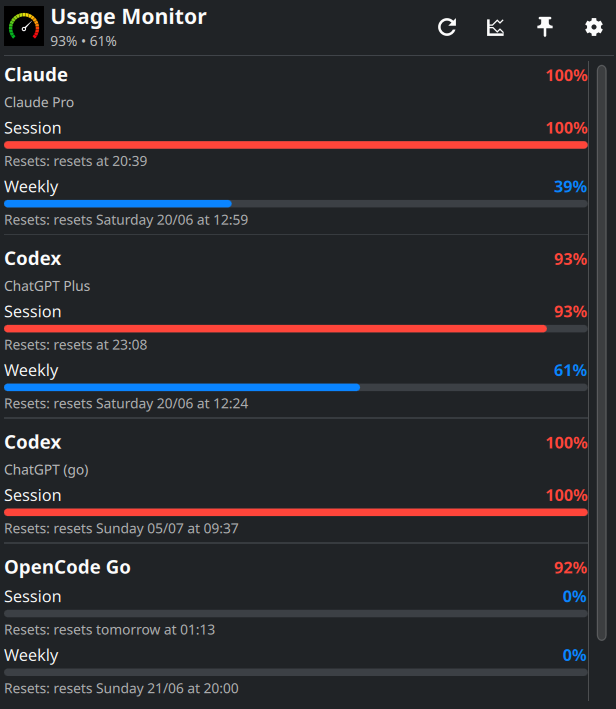

# KDE Plasma 6 widget

The plasmoid is embedded in the CLI binary; its source lives in the asset tree
at
[`usage-monitor-cli/assets/kde/package`](../../usage-monitor-cli/assets/kde/package)
and is written to disk by the `widget install` subcommand.

The panel bar shows the logo and the overall usage:



Clicking it opens the full popup, with one card per provider/account:



## Features

- Panel bar shows the bundled Usage Monitor logo plus the overall usage text (or
  a single pinned provider); the icon scales to the panel thickness so it stays
  visible on thin panels.
- Full popup (usage only) with one card per provider/account, an overall
  percentage, and a progress bar for every usage window (Session/Weekly/Monthly)
  returned by the provider, plus reset times and error/stale indicators.
- Popup toolbar: Refresh, Cost, **Pin** (keep popup open), and **Settings** (opens
  the native KDE configuration window).
- **Settings live in the native KDE config dialog** (right-click → Configure, or
  the popup Settings button), not in the popup, split into four pages:
  - **General** — refresh interval, show bar text, show account email, pin a
    provider to the panel bar, clear cache, and the CLI/plasmoid version footer.
  - **Providers** — search + enable/disable toggles
    (`usage-monitor-cli enable|disable <provider>`) and **Manage accounts** per
    provider: add/remove named accounts with a form shaped per provider auth type
    (see below), plus add/remove **workspaces** for opencode-go.
  - **Order** — drag to reorder providers.
  - **Theme** — colors, fonts and metrics for the panel bar and the popup (see
    [Theming](#theming)).
- The plasmoid **About** page (a fifth, native page in the same window) is
  populated from `metadata.json` (name, description, author, website, version);
  its bug-report link points to the project issues.
- Account identity under each usage card: the account **email** when the provider
  exposes it (e.g. Codex, decoded from the OAuth `id_token`), otherwise a
  configured label/id, otherwise the plan — so a card is never blank. (Claude's
  token carries no email, so it shows the plan.)
- **Theming**: follow the current desktop theme (default), pick one of five
  bundled themes (macOS Dark/Light, Nord, Dracula, Tokyo Night), reuse a KDE
  color scheme or Plasma desktop theme already installed on the system, or build
  a custom palette (colors, font family, text sizes, bar height, corner radius,
  background opacity) with a live preview.
- Last-good cache fallback when the CLI is unavailable or a fetch fails.

## Install

Build/install the CLI first so `usage-monitor-cli` is on `PATH`:

```bash
cargo install --path usage-monitor-cli
```

Then install the plasmoid:

```bash
usage-monitor-cli widget install kde
```

This stages the package under `~/.local/share/usage-monitor/kde/package`,
installs the project icon as
`~/.local/share/icons/hicolor/256x256/apps/usage-monitor.png`, and registers the
plasmoid with `kpackagetool6` (`--install` or `--upgrade` automatically). If
`kpackagetool6` is missing or fails, re-run with `--force` to copy the package
straight into `~/.local/share/plasma/plasmoids/dev.usage-monitor.kde`. Remove it
with `usage-monitor-cli widget uninstall kde`, and inspect resolved paths with
`usage-monitor-cli widget doctor`.

The installer also records the version and adds a login autostart entry that
runs `usage-monitor-cli widget sync`, so upgrading the CLI auto-upgrades the
plasmoid on the next login (see [Automatic upgrades](README.md#automatic-upgrades)).

Manual development install with `kpackagetool6` (equivalent to the above):

```bash
kpackagetool6 --type Plasma/Applet --install usage-monitor-cli/assets/kde/package
kpackagetool6 --type Plasma/Applet --upgrade usage-monitor-cli/assets/kde/package
kpackagetool6 --type Plasma/Applet --remove dev.usage-monitor.kde
```

If Plasma cannot find the CLI, set `USAGE_MONITOR_BIN` to an absolute path:

```bash
export USAGE_MONITOR_BIN="$HOME/.cargo/bin/usage-monitor-cli"
```

## Runtime files

The QML UI calls `contents/code/usage_monitor_kde.py`, which finds
`usage-monitor-cli` on `PATH` or uses `USAGE_MONITOR_BIN`. The helper caches the
last good payload in `$XDG_CACHE_HOME/usage-monitor-kde/last.json` and shows it
as stale if the CLI is temporarily unavailable.

The KDE widget also keeps widget-only state in
`$XDG_CONFIG_HOME/usage-monitor-kde/state.json` for bar text, refresh interval,
pinned provider, provider order, and the theme. Settings are edited in the
**native KDE config dialog** (`contents/config/config.qml` registers the
General/Providers/Order/Theme pages). All settings live in the helper's
`state.json`, not KConfig, so the pages drive the native **Apply/OK/Cancel** the
same way the Plasma System Monitor does: each page declares
`signal configurationChanged` (emitted on edit → enables Apply) and
`function saveConfig()` (called on Apply/OK → writes the pending values via the
helper). General (refresh interval, bar text, account email, pin), Order (drag
reorder) and Theme are **Apply-driven**; provider enable/disable, accounts,
workspaces and clear cache are immediate actions.

Because those settings bypass KConfig, the applet gets no change signal from
them. `main.xml` therefore carries one entry, `stateRevision`: once the helper
has finished writing `state.json`, `SettingsBackend.notifyApplet()` bumps it, and
`main.qml` reacts by reloading the settings plus the cached summary — so Apply
repaints the bar and popup right away (no network round-trip; live data still
comes on the next refresh tick) instead of waiting for that tick.

The UI is a port of the `codexbar-kde` plasmoid; codexbar-only controls (source
selector, all-accounts / status-pages / hide-credits switches) were dropped since
Usage Monitor auto-detects a single source per provider. The single-file helper
`usage_monitor_kde.py` owns all CLI, cache and formatting logic so it can be
tested without KDE running.

The Plasma UI lives under `contents/ui/`: `main.qml` (panel + usage popup),
`FullPopup.qml`, `UsagePage.qml`, `UsageBar.qml`, `ThemePalette.qml`,
`ThemedToolButton.qml`; the config pages `configGeneral.qml`,
`configProviders.qml`, `configOrder.qml`, `configTheme.qml` (+ the lazily loaded
`FontPicker.qml`); and their shared helper plumbing `SettingsBackend.qml`.

## Theming

The **Theme** settings page controls how the panel bar and the popup look. Four
modes, all resolved by the Python helper (`resolve_theme`) and rendered by
`ThemePalette.qml`:

| Mode | What it does |
|------|--------------|
| **Follow the current desktop theme** (default) | No colors of our own: every token falls back to `Kirigami.Theme`, so the widget matches whatever Plasma theme is active. |
| **Built-in theme** | One of five bundled palettes: macOS Dark, macOS Light, Nord, Dracula, Tokyo Night. |
| **Installed KDE theme / color scheme** | Any `.colors` scheme in `<data dir>/color-schemes` or Plasma desktop theme in `<data dir>/plasma/desktoptheme/*/colors` — including third-party ones installed from System Settings → **Get New Color Schemes** (the popular macOS look-alikes such as WhiteSur/McMojave land here). |
| **Custom** | Your own named themes. **New** creates one, **Delete** removes the selected one, and the editor sets its **Name**, its built-in **base theme** (used for anything you do not override), the eight colors, font family, text/title/small sizes, bar height, corner radius and background opacity. **Copy from base theme** prefills the color fields so you can tweak instead of typing eight hex values. The font is a free-text family name plus a **Choose…** button that opens the system font dialog (`ui/FontPicker.qml`, loaded on demand — a ComboBox listing every installed family would block Plasma's GUI thread while the style measures ~2000 entries). Add/rename/delete are pending edits like everything else: Apply commits them, Cancel drops them. |

Above the mode selector sits a **Transparency** slider (0–70 %, 0 % = solid). It
is global on purpose: it also applies while following the desktop theme, where
the widget tints with the inherited `Kirigami.Theme` colors instead of a palette
of its own. Only the background fill fades — text, icons and bars are siblings of
that layer, never children, so they stay fully opaque — and the popup keeps a
full-opacity 1 px outline so it still has a visible shape at high transparency.
The settings preview behaves the same way: its card fades into the settings page
while the sample text and bars stay solid. It is stored as `themeOpacity` (opacity, i.e. `1 - transparency`) and
overrides the per-theme value a custom theme may still carry.

Making the popup genuinely see-through needs one extra step. The popup Plasma
builds for an applet is a `PlasmaWindow`, and its background can only be
`StandardBackground` or `SolidBackground` — there is no "none", so a translucent
layer of ours would just blend with an opaque window and nothing would show
through. So above 0 % transparency the widget opens **its own**
`PlasmaCore.Dialog` with `backgroundHints: NoBackground` (anchored to the panel
slot via `visualParent`, auto-hiding through `hideOnWindowDeactivate`) and paints
the background itself; at 0 % the native popup is used, untouched. The trade-off
is that the custom popup has no Plasma dialog shadow or blur behind it — it is
the widget's own layer over whatever is on screen. A widget placed on the desktop
additionally switches `Plasmoid.backgroundHints` to `NoBackground` so the applet
card does not sit behind the translucent layer.

The themed tokens are `background`, `text`, `subtext`, `accent` (usage below
70%), `warning` (70–89%), `critical` (90%+), `track` (progress-bar groove) and
`border`. Colors accept `#rgb`, `#rrggbb`, `#aarrggbb` or KDE's `R,G,B`; anything
else is dropped by the helper so QML never receives an invalid color. The
settings page shows a **live preview** of the palette while you edit, before
Apply.

Controls that colour themselves from the desktop scheme are re-pointed at the
widget palette, because otherwise they vanish on a themed background (a white
gear icon on macOS Light, for example): the popup sets the `Kirigami.Theme`
colors for its subtree, and the toolbar uses `ThemedToolButton.qml`, which paints
its own icon and hover/pressed background. With "Follow the current desktop
theme" every one of those values resolves back to the Plasma color, so the native
look is unchanged.

Theme choices are stored in the widget's `state.json` under `themeMode`,
`themeBuiltin`, `themeScheme`, `themeCustomId` and `customThemes` (the named
custom themes, one JSON array in a single key so a save is one atomic write),
and are also emitted in the `summary` payload so the panel bar restyles on the
next refresh. Every custom theme is sanitized on read (`sanitize_custom_theme`):
unusable colors are dropped, sizes are coerced to numbers and an unknown base
falls back to the default, so a hand-edited `state.json` cannot feed QML an
invalid palette. Widgets configured before named themes existed keep working —
the old flat `themeCustom*` keys surface as one theme called "Custom" that can be
renamed like any other. If a selected color scheme is later uninstalled, the
widget falls back to the desktop theme instead of rendering an unreadable
palette.

## Managing accounts

Open **Manage accounts** under a provider. The add form adapts to how each
provider authenticates:

| Auth type | Providers | Add form |
|-----------|-----------|----------|
| **API key** | openai, anthropic, openrouter, groq, deepseek, kimik2, minimax, moonshot, venice, zai, elevenlabs, deepgram (+project id), llmproxy (+base url) | name + API key |
| **Token** | grok, kimi, copilot, devin (+org), windsurf | name + token |
| **Cookie** | abacus, mistral, ollama, cursor, perplexity | name + session cookie |
| **OAuth / CLI** | codex, claude, gemini, antigravity | name + credentials path (login done in a terminal — see below) |
| **opencode-go** | opencode-go | name + cookie, plus workspace add/remove |

OAuth providers need a CLI login **before** pointing the widget at the
credentials file. The form shows the exact commands; for example, a second Codex
account needs its own isolated login (you cannot copy `auth.json`):

```bash
CODEX_HOME=~/.codex-go codex login --device-auth   # in a terminal
# then in the widget: Manage accounts → name "go", credentials path ~/.codex-go/auth.json
```

See the per-provider pages under [`docs/providers/`](../providers/README.md) for
the full multi-account setup of codex, claude, gemini, and antigravity.

## Helper commands

These are mostly for debugging; Plasma calls them automatically:

```bash
CODE=usage-monitor-cli/assets/kde/package/contents/code/usage_monitor_kde.py
python "$CODE" summary
python "$CODE" settings
python "$CODE" cache
python "$CODE" cache-clear
python "$CODE" cost
python "$CODE" themes          # resolved palette + built-in/installed catalog
python "$CODE" set-state --key refreshIntervalSeconds --value 60
python "$CODE" set-state --key themeMode --value builtin
python "$CODE" set-state --key themeBuiltin --value nord
python "$CODE" set-provider --provider claude --enabled true
python "$CODE" account-save --provider openai --name work --json '{"api_key":"sk-…"}'
python "$CODE" account-remove --provider openai --name work
python "$CODE" workspace-add --workspace wrk_… --name "My WS"
python "$CODE" workspace-remove --workspace wrk_…
```

## Troubleshooting

- Stale panel data: open settings, **Clear cache**, then **Refresh**.
- Toggle failures: run the equivalent CLI command in a terminal, e.g.
  `usage-monitor-cli claude account list`.
- Old UI after upgrade: run `usage-monitor-cli widget install kde` again (it
  upgrades in place) and restart Plasma if the old UI is still cached.

## Tests

```bash
python -m unittest discover -s widgets/kde -p 'test_*.py'
qmllint usage-monitor-cli/assets/kde/package/contents/ui/*.qml
```
